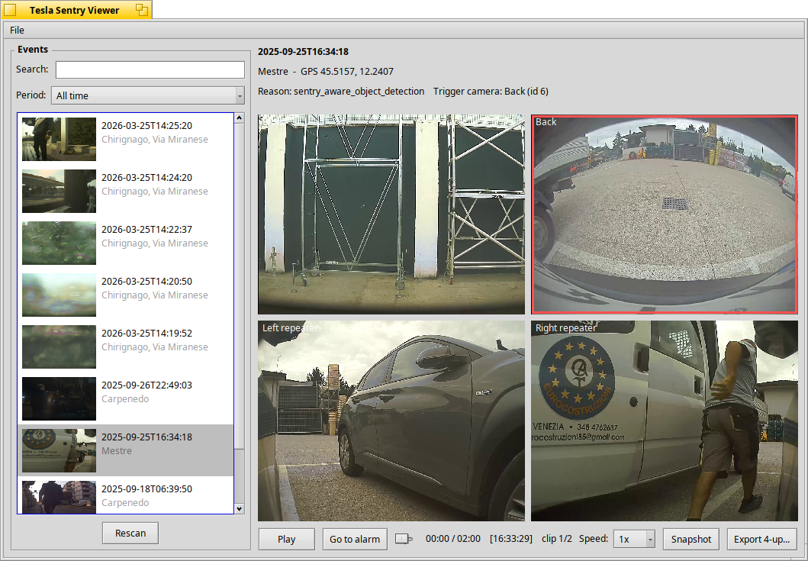

# TeslaViewer for Haiku

Native Haiku app to review your Tesla Sentry / Dashcam recordings: 4-camera synchronized playback, event list with thumbnails, GPS map with OpenStreetMap tiles, alarm timeline markers, snapshots and 4-up MP4 export.

Drop in the contents of a `TeslaCam/SentryClips` (or `SavedClips`) folder from a Tesla USB drive and you're ready to go. No conversion, no transcoding, no internet (except for map tiles).

If TeslaViewer for Haiku saves you time, consider supporting development: [](https://buymeacoffee.com/atomozero)

## Screenshot



## Features

* Native Haiku GUI built on BMediaKit, no transcoding required
* Synchronized 2×2 grid of Front / Back / Left repeater / Right repeater
* Global timeline that auto-concatenates the 1-minute clips of an event
* Red tick on the slider marking the exact alarm instant from `event.json`
* "Go to alarm" jumps all 4 cameras to that instant in one click
* Click any camera to maximize it; click again to return to the grid
* Highlight ring on the camera that triggered the alarm
* Wall-clock time shown alongside elapsed/total (e.g. `00:23 / 02:00 [14:24:51]`)
* Playback speed: 0.25× / 0.5× / 1× / 2× / 4×
* Event list with thumbnails, text search and date-range filter
* GPS map with OSM tiles, panning, zooming, clickable event pins
* Click the GPS coordinates in the info bar to open the map centered on the event
* Snapshot the current camera frame as PNG
* Export the 4 cameras of a clip into a single 2×2 MP4 via `ffmpeg`
* Camera id remapping dialog (Tesla camera ids vary per firmware)
* Persisted preferences: last folder, window frame, default speed, camera map
* No external dependencies beyond Haiku system libraries, `curl` and `ffmpeg`

## Quick start

```
make
./TeslaViewer
```

The window opens on the last folder you used (default: `/boot/home/Desktop/Tesla`). Use `File → Open folder...` (`Alt+O`) to pick another `SentryClips` or `SavedClips` directory from a Tesla USB drive.

- Select an event on the left → the 4 cameras load
- **Space** plays/pauses, **A** jumps to the alarm
- **Click a camera tile** to maximize, click again to restore
- **S** saves a snapshot of the active camera
- **Alt+M** opens the map of events; click a pin to select that event
- **Click on the GPS coordinates** in the info bar → opens the map centered there

## Keyboard shortcuts

| Key       | Action                                |
| --------- | ------------------------------------- |
| `Space`   | Play / pause                          |
| `A` / `↑` | Go to the alarm instant               |
| `F`       | Toggle fullscreen on focused camera   |
| `1` – `4` | Set the active camera (highlight)     |
| `← / →`   | Seek 5 seconds back / forward         |
| `S`       | Snapshot the active camera as PNG     |
| `Alt+O`   | Open folder...                        |
| `Alt+R`   | Rescan the current folder             |
| `Alt+M`   | Open the event map                    |
| `Alt+Q`   | Quit                                  |

## Build

Requires Haiku with GCC (C++17) and the following packages:

- `ffmpeg6` for the 4-up MP4 export (from HaikuDepot)
- `curl` for downloading OSM tiles (already in Haiku base)
- Standard system libraries (`libbe`, `libmedia`, `libtracker`, `libtranslation`)

```
make                 # builds the TeslaViewer binary
make run             # build + run
make clean           # remove all build artifacts
```

The Makefile tracks header dependencies (`-MMD -MP`), so changing a `.h` triggers a proper rebuild of the `.cpp` files that include it.

## Tesla folder layout

Each event is a directory containing the 4 MP4 streams for every recorded minute plus `event.json` and `thumb.png`:

```
<root>/
├── 2026-03-25_14-20-38/
│   ├── 2026-03-25_14-19-26-front.mp4
│   ├── 2026-03-25_14-19-26-back.mp4
│   ├── 2026-03-25_14-19-26-left_repeater.mp4
│   ├── 2026-03-25_14-19-26-right_repeater.mp4
│   ├── 2026-03-25_14-20-26-front.mp4
│   ├── ...
│   ├── event.json
│   └── thumb.png
└── ...
```

Sample `event.json`:

```json
{
    "timestamp": "2026-03-25T14:19:52",
    "city": "Chirignago",
    "street": "Via Miranese",
    "est_lat": "45.4853",
    "est_lon": "12.2004",
    "reason": "sentry_aware_object_detection",
    "camera": "0"
}
```

## Where files are stored

| Path                                          | Contents                                  |
| --------------------------------------------- | ----------------------------------------- |
| `~/config/settings/TeslaViewer`               | preferences (flat `BMessage`)             |
| `~/config/cache/TeslaViewer/tiles/Z/X/Y.png`  | OSM tile cache                            |
| `<event>/snapshot_<cam>_<HH-MM-SS>.png`       | snapshots taken from the playback         |
| `<event>/4up_<timestamp>.mp4`                 | 4-up exports                              |
| `<event>/4up_<timestamp>.log`                 | `ffmpeg` log for that export              |

## Notes

- Tesla Sentry videos **have no audio track** by design, the app does not play audio.
- The `camera` field in `event.json` is a numeric id whose mapping changes per firmware. Use `File → Camera mapping...` to assign each id you see in your events to the right physical camera; the mapping is saved.
- Export uses **MPEG-4** because `libx264` is not bundled with Haiku's `ffmpeg6`. The output plays everywhere; file size is roughly 2× compared to x264.
- OSM tile traffic is rate-limited by their [Tile Usage Policy](https://operations.osmfoundation.org/policies/tiles/). The app caches every tile to disk and identifies itself with a proper `User-Agent`.

## Be careful
> **Developer's Note**: This software may contain traces of peanuts and LLM. It has been developed with passion for the Haiku platform.

## Support

If you find this project useful, you can buy me a coffee: [](https://buymeacoffee.com/atomozero)
